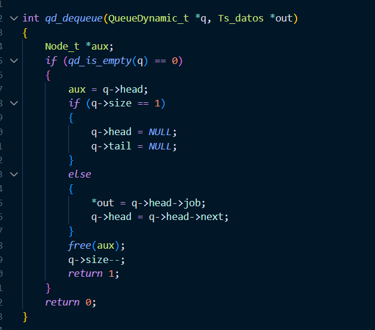
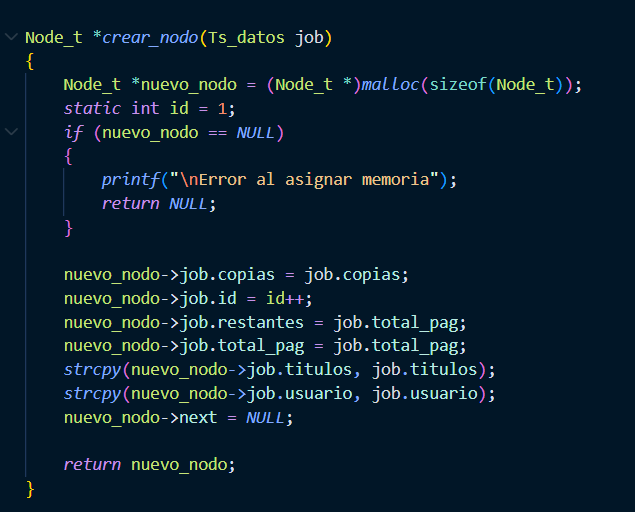

+++
date = '2026-03-13T20:44:50-07:00'
draft = false
title = 'Practica1: Elementos basicos de los lenguajes de programacion'
+++

# PP_PL1 - Cola de impresion (Informe)

Referencia: Guia de practica asignada.

## 1. Introduccion

Esta practica implementa un simulador de cola de impresion en C.

Objetivos principales:

- Comprender y comparar la memoria estatica vs dinamica.
- Implementar una cola **FIFO** (First In, First Out) en dos versiones: arreglo fijo y lista enlazada.
- Disenar funciones con contratos claros (mutadoras vs lectoras).
- Simular el avance de impresion (pagina a pagina) y manejar metadatos del trabajo (ID, copias, prioridad, estado).

Nota: El trabajo se dividio en tres sesiones: sesion 1 (cola estatica), sesion 2 (intermedia/migracion) y sesion 3 (cola dinamica y simulacion).

## 2. Diseno

### 2.1 Estructura de un trabajo de impresion (Ts_datos)

```c
typedef struct datos {
    int id;
    char usuario[40];
    char titulos[40];
    int total_pag;
    int restantes;          // Paginas que faltan por imprimir
    int copias;
    Tf_prioridad prioridad; // NORMAL / URGENTE
    Tf_estado estado;       // EN_COLA / IMPRIMIENDO / COMPLETADO
} Ts_datos;
```

Notas sobre la estructura:

- **restantes**: Se inicializa con `total_pag` y se decrementa durante la simulacion.
- **copias**: Indica cuantas veces se imprimen todas las paginas.
- **prioridad**: Permite establecer politicas de insercion/atencion.
- **estado**: Refleja el ciclo de vida del trabajo de impresion.

### 2.2 Cola Estatica (QueueStatic_t) - Sesion 1

```c
#define MAX_JOBS 10

typedef struct {
    Ts_datos data[MAX_JOBS];
    int size;
} QueueStatic_t;
```

- **enqueue**: Anade un elemento en `data[size]` si la cola no esta llena.
- **peek**: Devuelve `data[0]` por copia sin alterar la cola.
- **dequeue**: Copia `data[0]` a una variable de salida, desplaza `data[1..size-1]` hacia la izquierda y decrementa `size`.

### 2.3 Cola Dinamica (QueueDynamic_t) - Sesion 3

```c
typedef struct Node_t {
    Ts_datos job;
    struct Node_t *next;
} Node_t;

typedef struct {
    Node_t *head;
    Node_t *tail;
    int size;
} QueueDynamic_t;
```

- **head** y **tail**: Apuntan al primer nodo (frente) y al ultimo nodo, respectivamente.
- **enqueue (Normal)**: Inserta al final (`tail->next = nuevo; tail = nuevo`).
- **enqueue (Urgente)**: Inserta al frente (`nuevo->next = head; head = nuevo`).
- **dequeue**: Remueve el `head`, devuelve el `job`, libera el nodo y ajusta punteros.

## 3. Implementacion (Resumen y Contratos)

### Sesion 1 (Estatica) - Funciones clave

- `void qs_init(QueueStatic_t *q);` Inicializa `size = 0`.
- `int qs_is_empty(const QueueStatic_t *q);` Retorna 1 si esta vacia, 0 si no.
- `int qs_is_full(const QueueStatic_t *q);` Retorna 1 si esta llena.
- `int qs_enqueue(QueueStatic_t *q, Ts_datos job);` Agrega un trabajo.
- `int qs_peek(const QueueStatic_t *q, Ts_datos *out);` Copia `data[0]` en `*out` (retorna 1/0).
- `int qs_dequeue(QueueStatic_t *q, Ts_datos *out);` Extrae `data[0]`, desplaza el arreglo y reduce `size`.
- `void qs_print(const QueueStatic_t *q);` Imprime los trabajos simulando delays.

Contrato de Sesion 1:

- Las funciones que modifican la cola reciben `QueueStatic_t *q`.
- Las que solo consultan reciben `const QueueStatic_t *q`.

### Sesion 3 (Dinamica) - Funciones clave

- `void qd_init(QueueDynamic_t *q);` Inicializa la cola dinamica.
- `int qd_is_empty(const QueueDynamic_t *q);` Verifica si esta vacia.
- `Node_t *crear_nodo(Ts_datos job);` Reserva memoria (`malloc`) y copia campos.
- `int qd_enqueue(QueueDynamic_t *q, Ts_datos job);` Inserta segun prioridad.
- `int qd_peek(const QueueDynamic_t *q, Ts_datos *out);` Copia `head->job` a `*out`.
- `int qd_dequeue(QueueDynamic_t *q, Ts_datos *out);` Extrae el trabajo, mueve `head` y libera memoria.
- `int mostrar_cola(QueueDynamic_t *q);` Simula la impresion con delays.
- `void qd_destroy(QueueDynamic_t *q);` Libera todos los nodos y limpia la cola.

Contrato de Sesion 3:

- `qd_peek` usa `const` para prometer no modificar la cola.
- `qd_enqueue` y `qd_dequeue` si la modifican.

## 4. Demostracion de Conceptos

### 4.1 Alcance y duracion de variables

- Variable local (stack): Ej. `int opcion;` en el `main`.
- Variable estatica (duracion estatica): Ej. `static int id = 0;`.
- Variables en heap: Nodos creados dinamicamente.

### 4.2 Memoria: Stack vs Heap

- **Stack**: `Ts_datos datos;` declarada como variable local.
- **Heap**: Uso de `malloc` y `free`.

```c
// Ejemplo de uso del Heap
Node_t *nuevo_nodo = (Node_t *)malloc(sizeof(Node_t));
/* ... operaciones ... */
free(aux);
```

### 4.3 Subprogramas y Contratos

- **Mutador**: `int qd_enqueue(...)` Modifica el estado de la cola.
- **Lector**: `int qd_peek(...)` Solo inspecciona, no muta la estructura.

## 5. Simulacion de Impresion

### 5.1 Control de progreso

- `job.restantes` inicia igual que `job.total_pag`.
- Por cada pagina impresa, se ejecuta `job.restantes--`.
- Para multiples copias, se utiliza un bucle `for (c = 0; c < copias; c++)` imprimiendo todas las paginas por ciclo.

### 5.2 Delay (Simulacion de tiempo real)

- Windows: `Sleep(300);`
- Linux/POSIX: `usleep(300000);`
- Recomendacion: Crear una funcion `msleep(unsigned ms)` para mejorar la portabilidad multiplataforma.

### 5.3 Ejemplo de salida (5 paginas, 2 copias)

```text
Copia 1 - pagina 1 de 5
Copia 1 - pagina 2 de 5
Copia 1 - pagina 3 de 5
Copia 1 - pagina 4 de 5
Copia 1 - pagina 5 de 5
Copia 2 - pagina 1 de 5
...
```

## 6. Analisis Comparativo: Estatica vs Dinamica

| Caracteristica | Cola Estatica (Arreglo) | Cola Dinamica (Lista Enlazada) |
| --- | --- | --- |
| Implementacion | Simple, sin malloc. | Requiere manejo explicito (malloc/free). |
| Capacidad | Fija (MAX_JOBS), riesgo de rechazo. | Dinamica (limitada por la memoria del sistema). |
| Complejidad Enqueue | O(1) | O(1) (gracias al puntero tail). |
| Complejidad Dequeue | O(n) (debido al desplazamiento). | O(1) |
| Riesgos principales | Overflow logico (cola llena). | Fugas de memoria, malloc puede fallar (NULL). |

## 7. Observaciones y Correcciones Recomendadas

Antes de entregar, asegurate de revisar estos detalles en tu codigo fuente:

- Unificar asignacion de ID: Decide si el contador vive en `main` o en `crear_nodo` para evitar inconsistencias.
- Corregir `qd_enqueue` (prioridad): Usa `job.prioridad` (no `job.estado`). El bloque para prioridad urgente debe ser:

```c
// Insertar al frente (URGENTE)
nuevo_nodo->next = q->head;
q->head = nuevo_nodo;
if (q->tail == NULL) {
    q->tail = nuevo_nodo;
}
```

- Retornos consistentes: `qd_peek` debe retornar 1 al tener exito. Cambia `mostrar_cola` a tipo `void` o haz que retorne un codigo de estado.
- Liberacion segura en `qd_dequeue`: Asegura copiar `*out = aux->job;` antes de hacer `free(aux)`.
- Corregir `qd_destroy`: Itera usando `head`, libera cada nodo y al final asegura `head = tail = NULL; size = 0;`.
- Bug de impresion en `mostrar_cola`: Usa `actual->job` dentro del bucle iterativo, no `q->head->job`.
- Librerias y validaciones: Incluye `<stdlib.h>` y `<string.h>`. Valida que `total_pag > 0` y `copias >= 1` antes del `enqueue`.
- Responsabilidad de funciones: Evita usar `printf` dentro de `peek` o `enqueue`; estas solo deben manejar datos.

## 8. Preguntas Guia

### 8.1 Donde guardaste el contador de ID y por que?

- Problema actual: Hay inconsistencia al usar `static int id` y contadores en `main`.
- Solucion: El `main` debe controlar el ID y pasarlo completo al crear el `job`.

### 8.2 En la version dinamica: que funcion libera memoria? Como verificarlo?

- `qd_dequeue` libera nodos individuales con `free(aux)`.
- `qd_destroy` libera toda la cola al final.
- Verificacion: Usar Valgrind o comprobar que `q->head == NULL && q->tail == NULL && q->size == 0`.

### 8.3 Que invariantes mantiene la cola?

- Siempre `0 <= q->size`.
- En la estatica: `q->size <= MAX_JOBS`.
- Si `q->size == 0`, entonces `head == NULL && tail == NULL`.
- Si `q->size == 1`, entonces `head == tail` y `head->next == NULL`.

### 8.4 Por que `peek` no debe modificar la cola?

Porque es una operacion estrictamente de inspeccion (Lector). Modificarla rompe el contrato de diseno y puede causar efectos colaterales.

### 8.5 Si falla agregar trabajos, como distinguir cola llena de entrada invalida?

`qs_is_full` detecta si no hay espacio. Las validaciones de campos (`total_pag <= 0`) deben hacerse de manera independiente antes de llamar a `enqueue`, con mensajes de error especificos para cada caso.

## 9. Evidencia de Ejecucion 

- Captura agregando hasta `MAX_JOBS` para mostrar el mensaje **Cola llena**.
    
- Capturas de `enqueue`/`dequeue` demostrando el comportamiento **FIFO**.
    
    
- Capturas mostrando malloc 
    

## 10. Referencias

- Guia de la practica: `PP_PL1_Gallegos_40032`.


## 11. Conclusiones

En general la practica fue sencilla en cosas que si podria mejorar seria a la hora de hacer mas modular el programa, esta practica me ayudo a entender bien la cola y tambien el como aplicarla a un entorno real en este caso un impresora
