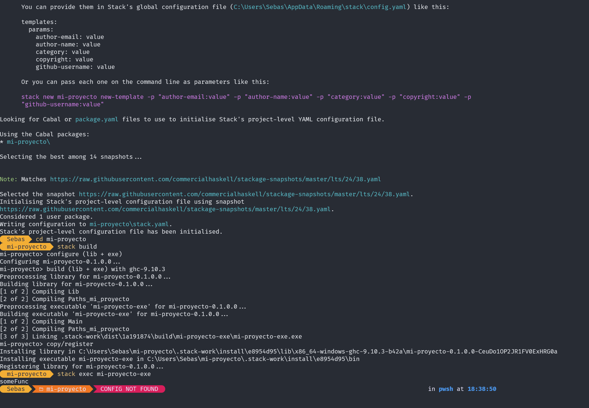
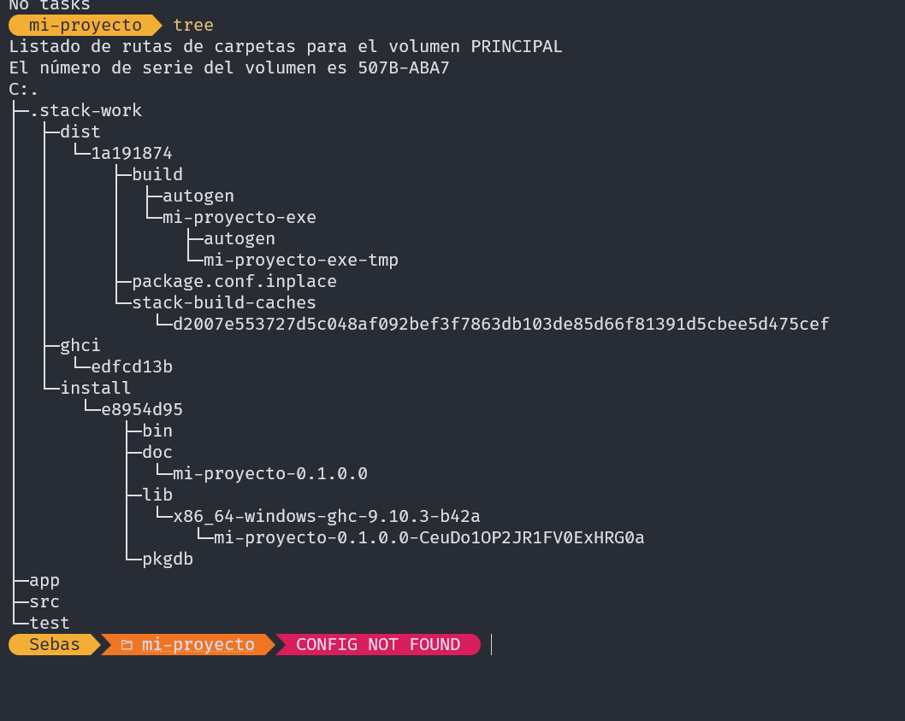
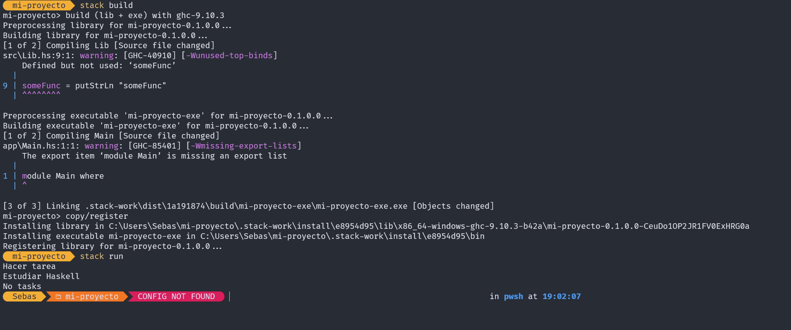

+++
date = '2026-03-13T20:47:47-07:00'
draft = false
title = 'Práctica 3: Programación funcional en Haskell'
+++

# Reporte: Instalación del entorno y aplicación TODO en Haskell

---

## 1. Instalación del entorno

Para trabajar con Haskell se utilizó la herramienta **Stack**, la cual permite gestionar proyectos, dependencias y la versión del compilador.

### Pasos realizados

1. Instalación de Stack desde la [página oficial de Haskell](https://www.haskell.org/).

2. Verificación de la instalación:
```bash
stack --version
```

3. Creación del proyecto:
```bash
stack new mi-proyecto
```

4. Acceso al proyecto:
```bash
cd mi-proyecto
```

5. Compilación del proyecto:
```bash
stack build
```

6. Ejecución del programa:
```bash
stack run
```

Durante este proceso, Stack descargó automáticamente el compilador **GHC** y configuró el entorno de desarrollo.

### Imágenes — Instalación del entorno


<!-- IMAGEN: captura de stack build -->


---

## 2. Descripción de la aplicación TODO

La aplicación implementada es un sistema básico de **lista de tareas (TODO list)** escrito en Haskell, utilizando el paradigma funcional.

### Estructura del proyecto

| Archivo | Descripción |
|---|---|
| `app/Main.hs` | Punto de entrada del programa |
| `src/Lib.hs` | Contiene la lógica principal |

### Imágenes — Estructura del proyecto




---

## 3. Funcionamiento de la aplicación

La aplicación trabaja con una estructura simple:

```haskell
type Todo = [String]
```

Esto representa una **lista de tareas**.

### Funcionalidades implementadas

#### 3.1 Agregar tarea

Permite insertar una nueva tarea en la lista:

```haskell
addTask :: String -> Todo -> Todo
addTask task list = task : list
```

#### 3.2 Mostrar tareas

Muestra todas las tareas almacenadas:

```haskell
showTasks :: Todo -> String
showTasks [] = "No tasks"
showTasks (x:xs) = x ++ "\n" ++ showTasks xs
```

#### 3.3 Eliminar tarea

Permite eliminar una tarea específica:

```haskell
removeTask :: String -> Todo -> Todo
removeTask _ [] = []
removeTask task (x:xs)
    | task == x = xs
    | otherwise = x : removeTask task xs
```

---

## 4. Ejecución del programa

En el archivo `Main.hs`, se realizan pruebas de la aplicación:

```haskell
main :: IO ()
main = do
    let tasks = []
    let tasks1 = addTask "Estudiar Haskell" tasks
    let tasks2 = addTask "Hacer tarea" tasks1

    putStrLn (showTasks tasks2)
```

### Imágenes — Ejecución




---

## 5. Conclusión

Haskell permite implementar aplicaciones mediante **programación funcional**, donde los datos no se modifican directamente, sino que se generan nuevas versiones de las estructuras.

La aplicación TODO demuestra el uso de:

- **Listas** como estructura de datos principal
- **Recursión** para recorrer y manipular las listas
- **Composición de funciones** para construir el flujo del programa
- **Stack** como gestor de proyectos y compilación
